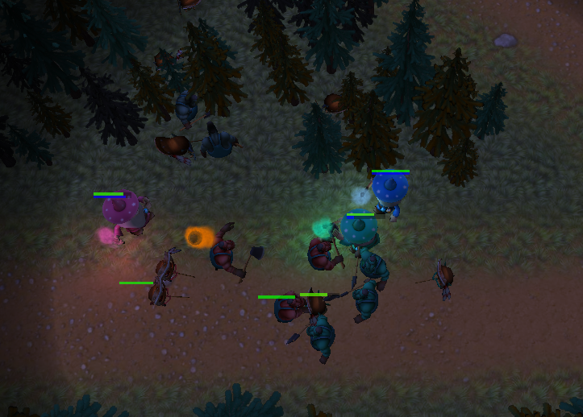

# Raicup2016

Solution for open artifical intelligence championship [Russian AI Cup 2016](http://russianaicup.ru/)

The task was to create strategy for control wizards in simplified MOBA-like game.

## Solution
Key parts of strategy

* Potential fields - used for positioning in battle and danger assessment for decision making.
* A\* search algorithm - combined with potential fields to improve navigation (especially through forest)
* Rasterisation algorithms (Bresenham's line and mid-point circle algorithm) - for fast intersection checking

### References
* [Good introduction to potential fields](http://aigamedev.com/open/tutorials/potential-fields/)
* [Influence map](http://aigamedev.com/open/tutorial/influence-map-mechanics/) - similar to potential fields, but with memory and more general
* [A\* description](http://theory.stanford.edu/~amitp/GameProgramming/AStarComparison.html#the-a-star-algorithm) and also [heuristic choose guide](http://theory.stanford.edu/~amitp/GameProgramming/Heuristics.html)
* [Bresenham's line](https://en.wikipedia.org/wiki/Bresenham's_line_algorithm) and [mid-point circle algorithm](https://en.wikipedia.org/wiki/Midpoint_circle_algorithm)

## License

All source code belonging to this repo distributed under [MIT License](./LICENSE). 

